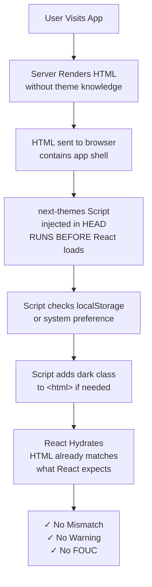

# Quick Reference - Hydration Fix Implementation

## Files Modified

### ✅ Created
1. **app/context/ThemeProvider.tsx** - Wraps app with next-themes
2. **app/components/ThemeToggle.tsx** - Theme toggle button with icons
3. **IMPLEMENTATION_GUIDE.md** - Complete code reference
4. **THEME_FIX_GUIDE.md** - Detailed explanation

### ✅ Modified
1. **app/layout.tsx** - Added suppressHydrationWarning + Providers wrapper
2. **app/components/Header.tsx** - Added ThemeToggle component

---

## Key Configuration

### next-themes Setup
```typescript
<ThemeProvider attribute="class" defaultTheme="light" enableSystem>
```

| Config | Value | Reason |
|--------|-------|--------|
| `attribute` | `"class"` | Adds/removes `dark` class on `<html>` for Tailwind |
| `defaultTheme` | `"light"` | Initial theme on first load |
| `enableSystem` | `true` | Respects OS dark mode preference |

### suppressHydrationWarning
```tsx
<html lang="en" suppressHydrationWarning>
```
- Tells React: "It's OK if `<html>` attributes differ server/client"
- next-themes script modifies it intentionally before hydration
- Safe because we control the theme script

---

## How It Prevents Hydration Errors



---

## Component Hierarchy

```
RootLayout (app/layout.tsx)
├─ <html suppressHydrationWarning>
│  └─ <Providers> (ThemeProvider wrapper)
│     └─ <CartProvider>
│        └─ children
│           └─ Header.tsx
│              └─ ThemeToggle.tsx
│                 └─ useTheme() hook
│                    └─ Controls theme via next-themes
```

---

## Installation Checklist

```bash
# 1. Install package
npm install next-themes

# 2. Verify files exist
ls app/context/ThemeProvider.tsx       # ✓
ls app/components/ThemeToggle.tsx      # ✓

# 3. Build
npm run build                          # Should succeed

# 4. Run dev
npm run dev

# 5. Test in browser
# - Open http://localhost:3000
# - Check console for errors (should be none)
# - Look for theme toggle in header
# - Click it (should switch theme instantly)
# - Refresh page (theme should persist)
# - Check DevTools: <html class="dark"> when dark mode on
```

---

## Troubleshooting

### Issue: "Module not found: 'next-themes'"
**Solution:** Run `npm install next-themes`

### Issue: "Cannot find name 'ThemeProvider'"
**Solution:** Make sure `app/context/ThemeProvider.tsx` exists and exports `Providers`

### Issue: Still seeing hydration warning
**Solution:** Check:
1. `suppressHydrationWarning` on `<html>` tag ✓
2. `Providers` wrapper in layout ✓
3. `ThemeToggle` has `if (!mounted) return null` ✓
4. `npm install` completed and `node_modules` updated ✓

### Issue: Theme toggle doesn't appear
**Solution:** 
1. Check ThemeToggle imported in Header: `import { ThemeToggle } from './ThemeToggle';`
2. Check it's rendered: `<ThemeToggle />` in JSX
3. Check browser console for errors

### Issue: Theme doesn't persist on refresh
**Solution:** next-themes saves to localStorage automatically. Check:
1. Browser localStorage isn't disabled
2. No errors in console
3. Theme saved in DevTools → Application → Local Storage

---

## CSS Usage with Dark Mode

Your Tailwind CSS v4 setup works automatically:

```tsx
// Light mode (default)
<div className="bg-white text-black">Light</div>

// Dark mode - add dark: prefix
<div className="dark:bg-black dark:text-white">Dark</div>

// Both
<div className="bg-white dark:bg-black text-black dark:text-white">
  Adapts to theme
</div>
```

---

## Browser DevTools Check

When dark mode is on, you should see:
```html
<html class="dark" lang="en" suppressHydrationWarning>
  <head>
    <script>
      /* next-themes script injected here */
    </script>
    <!-- rest of head -->
  </head>
  <body>
    <!-- app content -->
  </body>
</html>
```

---

## Performance Notes

✓ **Zero impact on load time** - next-themes script is tiny (~500 bytes)
✓ **No Flash** - Script runs before First Paint
✓ **No Layout Shift** - Theme applied before render
✓ **Cached** - localStorage lookup is instant

---

## Migration from Manual Theme System

If you previously had manual theme handling:

### Remove these:
```typescript
// ❌ Don't use localStorage directly
localStorage.getItem('theme')
localStorage.setItem('theme', 'dark')

// ❌ Don't manipulate DOM directly
document.documentElement.setAttribute('class', 'dark')
document.documentElement.classList.toggle('dark')

// ❌ Don't check window in SSR
if (typeof window !== 'undefined') { ... }
```

### Use instead:
```typescript
// ✓ Use next-themes hook
const { theme, setTheme } = useTheme();

// ✓ Let next-themes handle DOM & storage
setTheme('dark')

// ✓ next-themes handles SSR safety
```

---

## Next Steps

1. **Install Package**: `npm install next-themes`
2. **Build**: `npm run build`
3. **Test**: `npm run dev` and verify in browser
4. **Style**: Use `dark:` prefix in Tailwind classes where needed
5. **Deploy**: Push changes to production

---

## Production Deployment

No special configuration needed:
- next-themes works with Next.js static generation
- Works with server-side rendering
- Works with ISR (Incremental Static Regeneration)
- Works with API routes
- Works with middleware

Just ensure `suppressHydrationWarning` stays on `<html>` tag.
